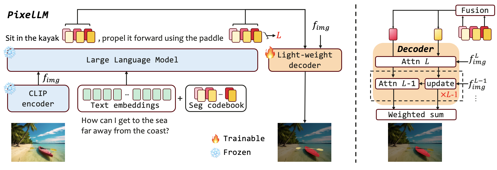
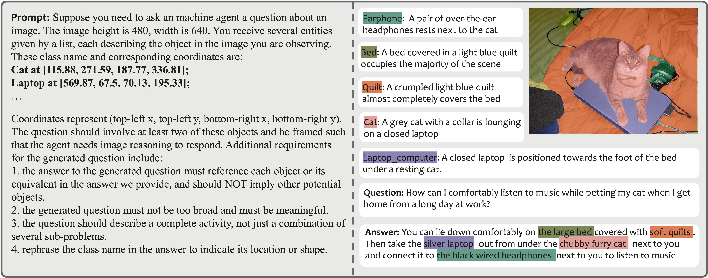

# PixelLM
> #### Zhongwei Ren\*, Zhicheng Huang\*, Yunchao Wei<sup>&dagger;</sup>, Yao Zhao, Dongmei Fu, Jiashi Feng, and Xiaojie Jin\*<sup>&dagger;</sup><sup>&ddagger;</sup>
> \* Equally contributing first authors, <sup>&dagger;</sup>Correspondence, <sup>&ddagger;</sup>Project Lead

> Beijing Jiaotong University, University of Science and Technology Beijing, ByteDance

<font size=7><div align='center' > <a href=https://arxiv.org/abs/2312.02228>**Paper**</a> | <a href="https://huggingface.co/maverickrzw/PixelLM-13B/tree/main">**Models**</a> | [**Training**](#training) | [**Inference**](#inference)  [**Dataset**](#dataset) | <a href="https://pixellm.github.io/">**Project Page**</a></div></font>


# Highlight

1. We present PixelLM, a novel LMM for pixel-level reasoning and understanding. PixelLM proficiently handles tasks with an arbitrary number of open-set targets and diverse reasoning complexities. Its design maintains the fundamental structure of LMMs while avoiding additional, costly segmentation models, enhancing both efficiency and transferability to diverse applications. 

2. We construct MUSE, a high-quality multi-target reasoning segmentation dataset, facilitating model training and evaluation in future research. Utilizing a GPT-4V-aided data curation pipeline, we create 246k question-answer pairs, covering 0.9 million instances. Our extensive ablation studies confirm the dataset's effectiveness in stimulating the model’s pixel reasoning capabilities.

3. PixelLM achieves new state-of-the-art results across a spectrum of benchmarks, significantly surpassing competing methods.


# Introduction
While large multimodal models (LMMs) have achieved remarkable progress, generating pixel-level masks for image reasoning tasks involving multiple open-world targets remains a challenge. To bridge this gap, we introduce PixelLM, an effective and efficient LMM for pixel-level reasoning and understanding. Central to PixelLM is a novel, lightweight pixel decoder and a comprehensive segmentation codebook. The decoder efficiently produces masks from the hidden embeddings of the codebook tokens, which encode detailed target-relevant information. With this design, PixelLM harmonizes with the structure of popular LMMs and avoids the need for additional costly segmentation models. Furthermore, we propose a target refinement loss to enhance the model's ability to differentiate between multiple targets, leading to substantially improved mask quality. To advance research in this area, we construct MUSE, a high-quality multi-target reasoning segmentation benchmark. PixelLM excels across various pixel-level image reasoning and understanding tasks, outperforming well-established methods in multiple benchmarks, including MUSE, single-
and multi-referring segmentation. Comprehensive ablations confirm the efficacy of each proposed component.

# Video
[](https://www.youtube.com/watch?v=sw2co_xaqPA "PixelLM Demo")


# Architecture



PixelLM features a streamlined architecture, comprising four main parts: i) a pretrained CLIP-ViT vision encoder 
 which aligns with text, ii) a large language model, iii) a lightweight pixel decoder 
 and iv) a segmentation codebook. PixelLM processes image and query text, yielding interleaved text description and corresponding masks for varied target. At the core of PixelLM is the novel lightweight decoder and the holistic segmentation codebook. The codebook contains learnable tokens which encode contexts and knowledge pertinent to targets referencing at different visual scales. The pixel decoder then produces target masks based on the hidden embeddings from the codebook tokens in conjunction with image features. Thanks to this design, PixelLM can generate high-quality masks without external segmentation models, significantly boosting its efficiency. Furthermore, we propose a target refinement loss to enhance the model's capability of differentiating between multiple targets, thus further improving the mask quality.


 # MUSE dataset



To facilitate model training and evaluation in this area of research, we develop MUSE, the first comprehensive multi-target reasoning segmentation dataset. MUSE stands out with its open-set concepts, detailed object descriptions, complex multi-target question-answer pairs, and instance-level mask annotations. Specifically, we feed all the instance category names and corresponding bounding box coordinates in the image to GPT-4V. Using carefully crafted prompts, GPT-4V autonomously selects instances to construct question-answer pairs relevant to the image content. The left panel of the figure above illustrates the prompt employed in our GPT-4V data generation pipeline. The right panel showcases an example of the generated data.

The dataset can be downloaded from this [link](https://drive.google.com/file/d/1IutofOF65azPEChVfyJWpcn3JgCfYwmA/view?usp=sharing)

## Installation
```
pip install -r requirements.txt
pip install flash-attn --no-build-isolation
```

## Training
### Training Data Preparation
Except for our MUSE data, other training data and data files are composed in the same way as [LISA](https://github.com/dvlab-research/LISA/tree/main?tab=readme-ov-file#training). You should also add COCO train2017 and COCO val 2017 under the refer_seg path

Download MUSE data from the above link and organize it as follows:
```
├── dataset
│   ├── ade20k
│   │   ├── annotations
│   │   └── images
│   ├── coco
│   │   └── train2017
│   │       ├── 000000000009.jpg
│   │       └── ...
│   ├── cocostuff
│   │   └── train2017
│   │       ├── 000000000009.png
│   │       └── ...
│   ├── llava_dataset
│   │   └── llava_instruct_150k.json
│   ├── mapillary
│   │   ├── config_v2.0.json
│   │   ├── testing
│   │   ├── training
│   │   └── validation
│   ├── reason_seg
│   │   └── ReasonSeg
│   │       ├── train
│   │       ├── val
│   │       └── explanatory
│   ├── refer_seg
│   │   ├── images
│   │   |   ├── saiapr_tc-12 
│   │   |   └── mscoco
│   │   |       └── images
│   │   |           ├── train2014
│   │   |           ├── train2017
│   │   |           └── val2017
│   │   ├── refclef
│   │   ├── refcoco
│   │   ├── refcoco+
│   │   └── refcocog
│   ├── vlpart
│   │   ├── paco
│   │   │   └── annotations
│   │   └── pascal_part
│   │       ├── train.json
│   │       └── VOCdevkit
│   └── muse
│       ├── muse_train.json
│       ├── muse_val.json
│       ├── muse_test_less.json
│       └── muse_test_many.json

```

### Pre-trained weights

#### LLaVA

Our training process requires first loading LLaVA's pre-trained weights. For PixelLM-7B, we use `LLaVA-Lightning-7B-v1-1`, and for PixelLM-13B, we use `liuhaotian/llava-llama-2-13b-chat-lightning-preview`. 

<!-- ### Support for SAM

PixelLM itself does not use SAM, but we have retained support for SAM. If you want to use SAM as a decoder for segmentation masks, please download SAM's weights. -->

### Training
```
deepspeed --master_port=24999 train_ds.py \
  --version="PATH_TO_LLaVA" \
  --dataset_dir='./dataset' \
  --dataset="sem_seg||refer_seg||vqa||multi_reason_seg" \
  --sample_rates="2,9,2,4" \
  --exp_name="pixellm-7b" \
  --vision-tower='openai/clip-vit-large-patch14-336' \
  --seg_token_num=3 \
  --num_classes_per_question=3 \
  --batch_size=2 \
  --pad_train_clip_images \
  --preprocessor_config='./configs/preprocessor_448.json' \
  --resize_vision_tower \
  --resize_vision_tower_size=448 \
  --vision_tower_for_mask \
  --use_expand_question_list \
  --image_feature_scale_num=2 \
  --separate_mm_projector \

```
When training is finished, to get the full model weight:
```
cd ./runs/pixellm-7b/ckpt_model && python zero_to_fp32.py . ../pytorch_model.bin
```

### Merge LoRA Weight
Merge the LoRA weights of `pytorch_model.bin`, save the resulting model into your desired path in the Hugging Face format:
```
CUDA_VISIBLE_DEVICES="" python merge_lora_weights_and_save_hf_model.py \
  --version="PATH_TO_LLaVA" \
  --weight="PATH_TO_pytorch_model.bin" \
  --save_path="PATH_TO_SAVED_MODEL"
```

## Inference 

Use `chat.py` to chat with [PixelLM-7B](https://huggingface.co/maverickrzw/PixelLM-7B/tree/main/hf_model) or [PixelLM-13B](https://huggingface.co/maverickrzw/PixelLM-13B/tree/main/hf_model)

```
python3 ./chat.py --version="./runs/PixeLM-13B/hf_model" --precision='bf16' --seg_token_num=3  \
--pad_train_clip_images \
--preprocessor_config='./configs/preprocessor_448.json' \
 --resize_vision_tower \
--resize_vision_tower_size=448 \
--vision-tower='openai/clip-vit-large-patch14-336' \
--vision_tower_for_mask \
--image_feature_scale_num=2 \
--separate_mm_projector
```

## Dataset

Each dict in the json file contains these keys: 
```
- "questions": text questions.
- "text_answers": textual answer to the question, in which the object instance involved is followed by a {seg} symbol.
- "answers": instance annotations contained in each answer.

```
A small number of question and answer pairs do not contain the text_answer key. Instead, the text answer is composed of the description of each object instance in the answer. The data loading file will load the data according to different situations.


## Citation 
If you find this project useful in your research, please consider citing:

```
@article{ren2023pixellm,
  title={PixelLM: Pixel Reasoning with Large Multimodal Model},
  author={Zhongwei Ren, Zhicheng Huang, Yunchao Wei, Yao Zhao, Dongmei Fu, Jiashi Feng, Xiaojie Jin},
  journal={arXiv preprint arXiv:2312.02228},
  year={2023}
}

## Acknowledgement
-  This work is built upon the [LLaVA](https://github.com/haotian-liu/LLaVA) and [LISA](https://github.com/dvlab-research/LISA?tab=readme-ov-file#dataset). 
